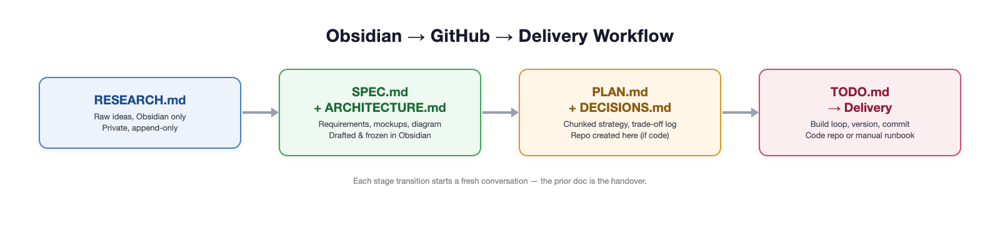
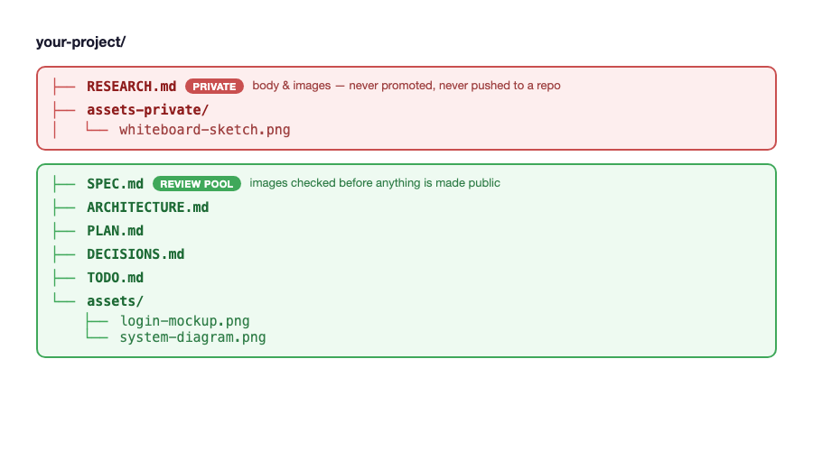

# delivery-templates

A document template set for running a project through a staged lifecycle — from a raw idea to a frozen spec to a chunked delivery plan — with each stage producing a durable artifact instead of relying on conversation memory.

## The lifecycle

1. **RESEARCH** — raw, append-only idea capture. Stays private wherever you keep it (e.g. a personal notes app) — never copied into this repo's equivalent of a real project.
2. **SPEC + ARCHITECTURE** — what/why/outcomes, requirements, UI mockups if any, system diagram, component table. Drafted and reviewed before anything is built. Frozen once delivery starts; amendments are deliberate, not silent.
3. **PLAN** — chunked delivery strategy, sequencing and dependencies between chunks, each chunk with its own definition of done.
4. **TODO → delivery** — fine-grained task tracking, blockers logged live, version/changelog discipline, build loop through to commit and push (or a manual runbook, if there's no code).

Every stage transition is meant to be a fresh start: the previous document is the handover, not assumed context. If something isn't written down, it doesn't carry forward.

## Files

| File | Purpose | Created |
|---|---|---|
| `RESEARCH.md` | Raw/ordered idea capture | First, stays private |
| `SPEC.md` | Requirements, goals, scope, UI mockups if applicable | After RESEARCH is ordered |
| `ARCHITECTURE.md` | System diagram, components, data flow, deployment | Alongside SPEC.md |
| `PLAN.md` | Chunked delivery strategy, sequencing | After SPEC/ARCHITECTURE are frozen |
| `TODO.md` | Live, fine-grained task board; blockers logged here | Alongside PLAN.md |
| `CHANGELOG.md` | One entry per version bump, version-stamped inline | Universal for code deliveries |
| `DECISIONS.md` | ADR-style trade-off log | Conditional — only when a real trade-off needs recording |

## Using these templates

Copy whichever files you need into a new project and fill them in — they're plain markdown with section headers, not tied to any specific tool. If you use Obsidian, the versions in this vault's `/Templates/` folder are Templater-driven and auto-derive cross-links between files; the copies here are static references for use outside Obsidian.

## Attachments convention

Images pasted into `RESEARCH.md` go in `assets-private/` next to the note — always private, never promoted. Images pasted into `SPEC.md`/`ARCHITECTURE.md` go in `assets/` — a review pool, checked image-by-image before anything is made public. This is a documented convention, not yet automatically enforced.

## License

No license file yet — treat as "all rights reserved" until one is added.
